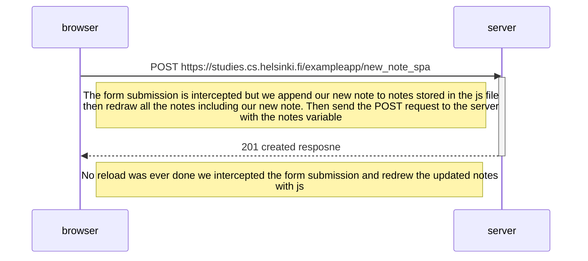

```mermaid
sequenceDiagram
    participant browser
    participant server

    browser->>server: POST https://studies.cs.helsinki.fi/exampleapp/new_note_spa
    activate server

    Note right of browser: The form submission is intercepted but we append our new note to notes stored in the js file<br> then redraw all the notes including our new note. Then send the POST request to the server<br>with the notes variable


    server-->>browser: 201 created resposne
    deactivate server

    Note right of browser: No reload was ever done we intercepted the form submission and redrew the updated notes<br>with js
```